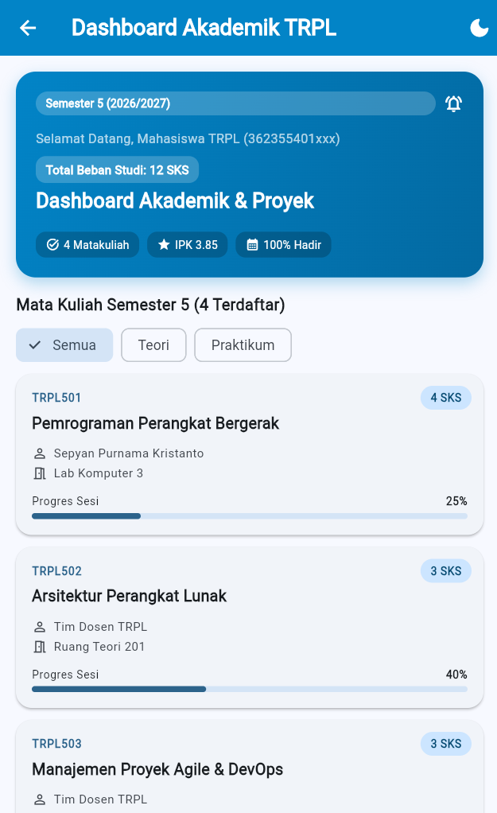
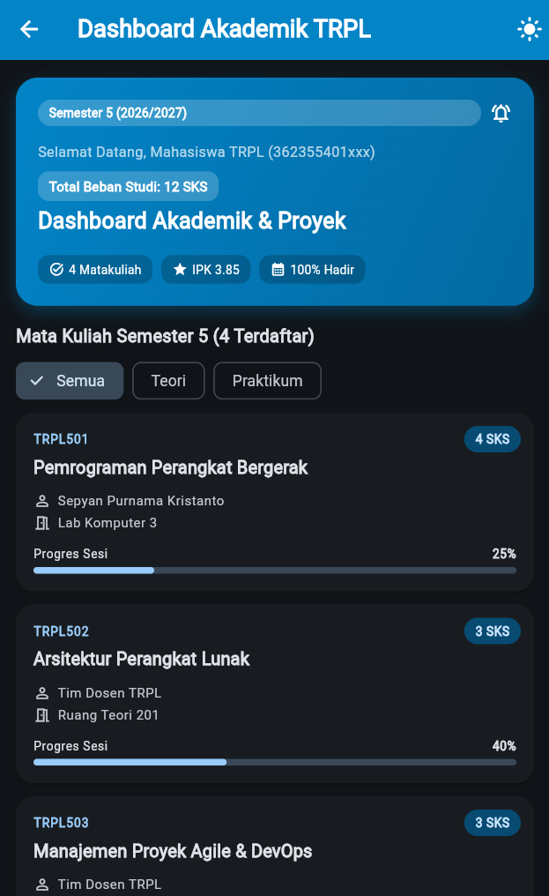
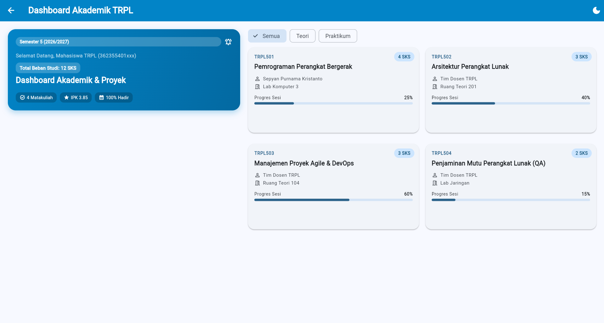
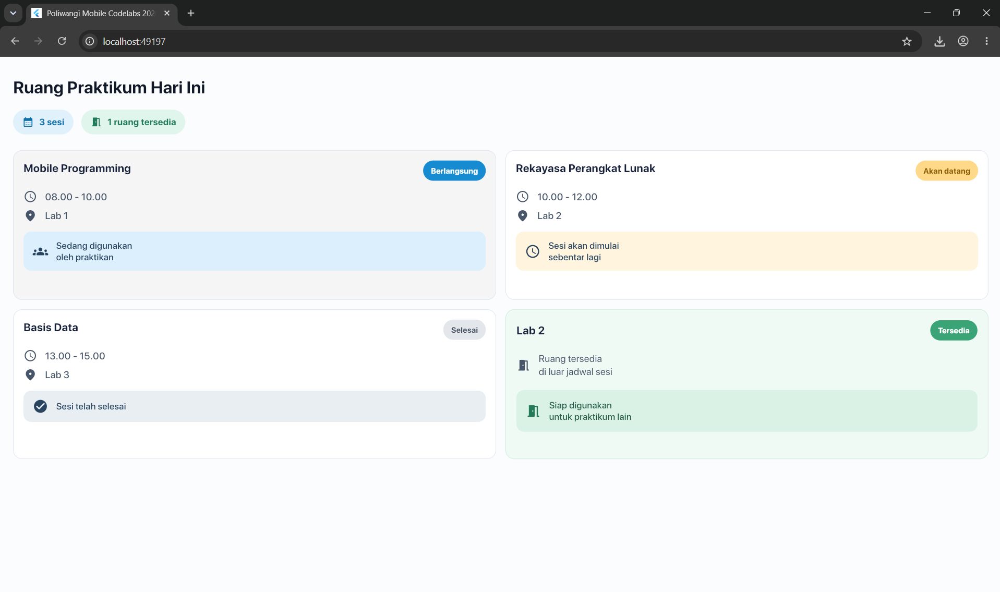
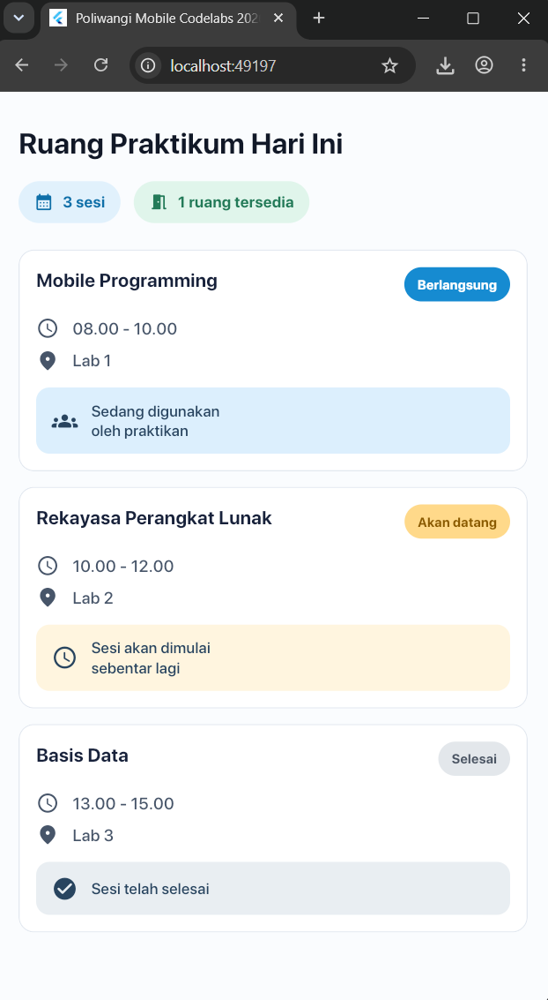

# Laporan Praktikum Modul 02: Declarative UI & Responsive Layout

- **Nama**: Adam Marchelino
- **NIM**: 362558302044
- **Kelas / Prodi**: 2C / Sarjana Terapan TRPL
- **Mata Kuliah**: Pemrograman Perangkat Bergerak (Semester 3)

---

## 1. Ringkasan Implementasi
Aplikasi modul_02 kali ini dibuat menggunakan pendekatan deklaratif ui dan material 3, Aplikasi menampilkan dashboard akademik mahasiswa yang berisi informasi profil, total SKS, daftar mata kuliah, dosen, ruangan, kategori, serta progres pembelajaran.

Layout dibuat responsif menggunakan LayoutBuilder. Pada layar smartphone, tampilan menggunakan satu kolom vertikal, sedangkan pada layar dengan lebar minimal 600dp, tampilan berubah menjadi dua kolom dengan daftar mata kuliah berbentuk grid. Aplikasi juga memiliki fitur filter kategori mata kuliah, mode terang dan gelap, kartu mata kuliah interaktif, serta bottom sheet untuk melihat detail mata kuliah.

## 2. Bukti Tangkapan Layar (Running App)
| Mode Portrait (Light) | Mode Dark Theme | Mode Landscape / Tablet (2 Kolom) |
|---|---|---|
|  |  |  |

| Mode Portrait (Light) | Mode Potrait | 
|---|---|---|
|  |  |

## 3. Kendala Layout yang Dihadapi & Solusinya
- **Kendala**: Nama mata kuliah, nama dosen, melebihi batas kartu dan mengacaukan layout, menjadi acak acakan
- **Solusi**: Menggunakan expanded pada bagian teks di dalam row, Kemudian membatasi teks dengan maxLines dan TextOverflow.ellipsis. Judul mata kuliah dibatasi maksimal dua baris agar tinggi kartu tetap konsisten.

- **Kendala**: Tampilan daftar mata kuliah kurang optimal jika menggunakan layout yang sama pada smartphone dan tablet.
- **Solusi**: Menggunakan LayoutBuilder untuk membaca lebar layar. Smartphone menggunakan satu kolom, sedangkan layar lebar menggunakan dua kolom dengan GridView.

## 4. Jawaban Pertanyaan Refleksi
1. **Efisiensi Single-pass BoxConstraints**:
   Sistem ini efisien karena widget dapat menentukan layout dan posisinya tanpa melakukan perhitungan layout berulang
2. **Kriteria Modularisasi Widget**: 
   Widget dapat dimodularisasi ketika memiliki fungsi dan tanggung jawab yang jelas. Pada aplikasi ini, HeaderBanner digunakan untuk menampilkan informasi profil dan ringkasan akademik, sedangkan CourseCard digunakan untuk menampilkan informasi setiap mata kuliah. Pemisahan ini membuat kode lebih mudah dibaca, dirawat, diuji, dan digunakan kembali.
3. **Manfaat M3 ThemeData Terpusat**:
   ThemeData Material 3 membantu menjaga konsistensi warna, tipografi, dan komponen antarmuka. Dengan menggunakan ColorScheme.fromSeed, aplikasi dapat mendukung mode terang dan gelap dengan lebih mudah. Widget juga dapat mengambil warna tema melalui Theme.of(context), sehingga tidak perlu mendefinisikan warna secara berulang.
